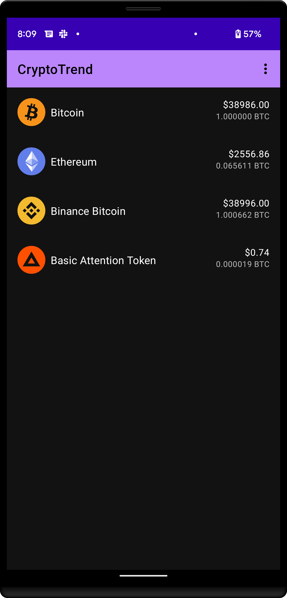
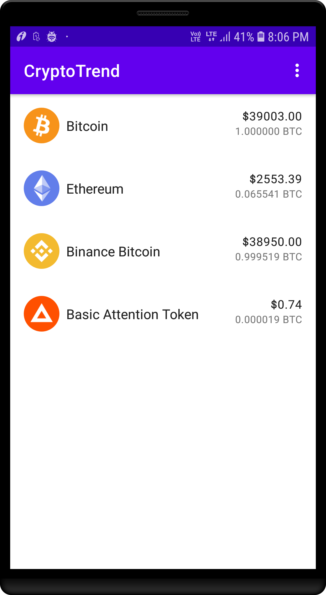
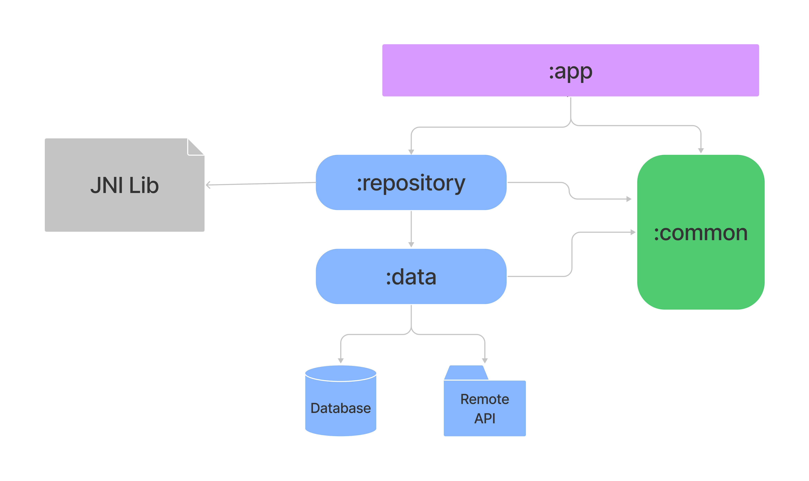
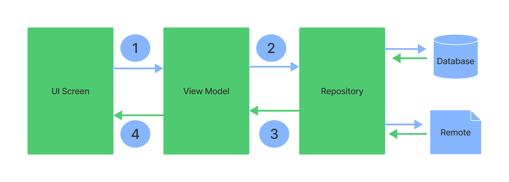
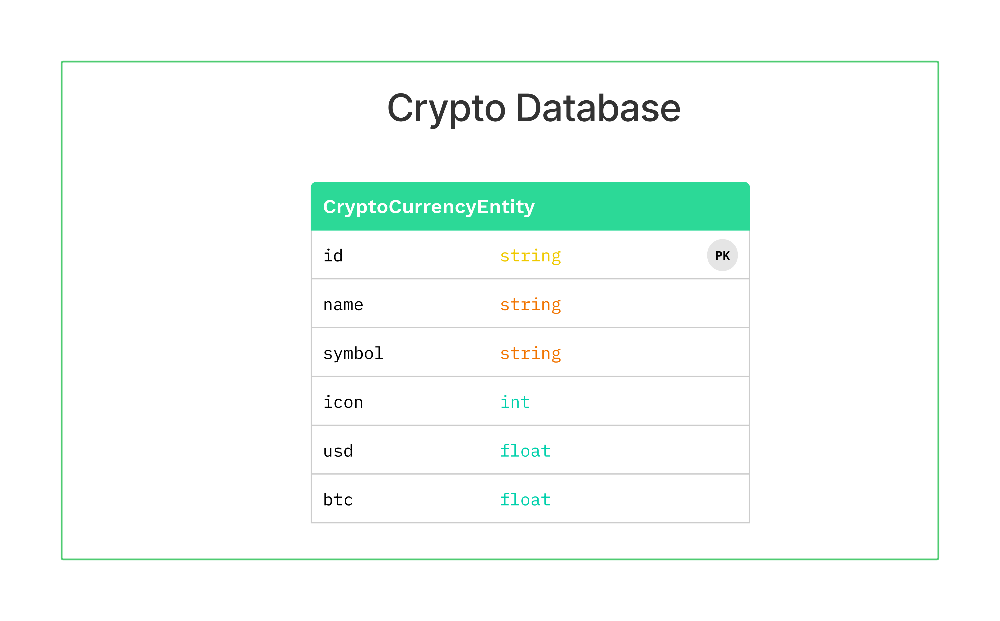

# CryptoTrend

CryptoTrend Application allow the user to see the details(Exchange rates) of crypto currency.

## Functional Requirement

- Create an application in Android Studio.
- Add components to complete the layout above. You may export the assets from the Figma link
  provided.
- Assets within the ListView should be shown in their USD value as well as the BTC value.
- The application should retrieve the new rates and update the layout and the ListView every 5
  seconds.
- Create a JNI call to a native(c++) code on each fetch of the new data for each currency, modify
  the data inside the native code to pass a string in the following format:
  <timestampt> <cryptocurrency symbol> <price (USD)>
- In Java save the passed string in a logs file.
- Push all the work done in 8 hours to the github repository.

## Non-Functional Requirement

- Use a software architecture pattern (MVVM)
- Use Coroutines and Room
- Use Kotlin instead of Java
- Add unit tests for your code
- Added Offline support

## Screenshots

  
  

## Output

You can find final CryptoTrend Application (APK) under apk directory of root project.

## Export Logs

You can export logs from option menu (on top right menu) -> Export Logs

## Client-Server Communication

Mobile application will communicate with backend server through REST Http APIs. Use
the [CoinGecko](https://www.coingecko.com/en/api) API to get the crypto currency details.

## APIs

| API Name         | Endpoint                                    | Type   |
| ---------------- |:-------------------------------------------:| -----: |
| Get Details      | https://api.coingecko.com/api/v3/coins/{id} |  GET   |

## High Level Design

## Data Flow

## Database Structure

## Test cases covered

* Added instrumentation test for database.
* Added JUnit test cases for network layer.

## Tools

- Android Studio Bumblebee | 2021.1.1
- Kotlin (version 1.6.10)
- Gradle (version 7.1.0)

## Libraries

* [Architecture](https://developer.android.com/jetpack/arch/) - A collection of libraries that helps
  to design robust, testable, and maintainable apps.
    * [Lifecycles](https://developer.andhttps://coil-kt.github.io/coil/roid.com/topic/libraries/architecture/lifecycle)
        - Build lifecycle-aware components that can adjust behavior based on the current lifecycle
          state of an activity or fragment.
    * [ViewModel](https://developer.android.com/topic/libraries/architecture/viewmodel) - To store
      and manage UI-related data in a lifecycle conscious way.
    * [Hilt](https://developer.android.com/training/dependency-injection/hilt-android) -
      for [dependency injection](https://developer.android.com/training/dependency-injection)
    * [Room](https://developer.android.com/jetpack/androidx/releases/room) - The Room persistence
      library provides an abstraction layer over SQLite to allow for more robust database access
      while harnessing the full power of SQLite.

* [UI](https://developer.android.com/guide/topics/ui) - Details on why and how to use UI Components
  in your apps - together or separate
    * [Material](https://material.io/develop/android) - Material Components for Android
    * [Splash](https://developer.android.com/guide/topics/ui/splash-screen) - App startup screen

* Third party and miscellaneous libraries
    * [Retrofit](https://square.github.io/retrofit/) - A type-safe HTTP client for Android and Java